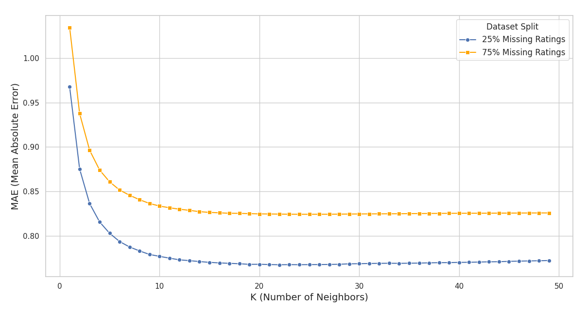
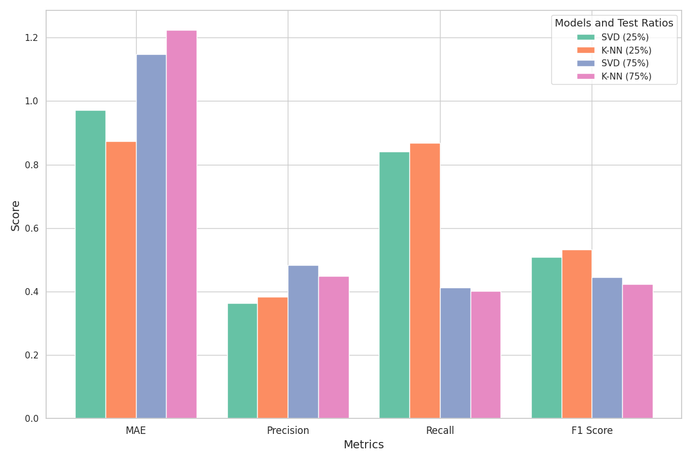
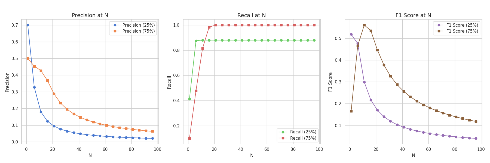
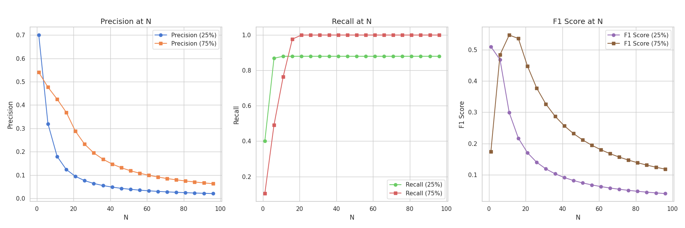

# Collaborative Filtering Benchmarking

This repository contains the solution for collaborative filtering tasks, implemented with Python’s Surprise library. The project includes optimizing user-based K-Nearest Neighbors (K-NN) by tuning the number of neighbors (K) to minimize Mean Absolute Error (MAE) under different levels of sparsity, addressing sparsity issues with SVD (Singular Value Decomposition) and its Funk variant, and comparing the performance of K-NN and SVD in generating Top-N recommendations with varying levels of missing ratings.

## Setup

1. Clone the repository:

```bash
git clone git@github.com:ikajdan/collaborative_filtering_benchmarking.git
cd collaborative_filtering_benchmarking
```

2. Create and activate a virtual environment:

```bash
python -m venv .venv
source .venv/bin/activate
```

3. Install the required packages:

```bash
pip install -r requirements.txt
```

4. Download the data:

```bash
curl -O https://files.grouplens.org/datasets/movielens/ml-100k.zip
unzip ml-100k.zip
```

## Task 1

<details>
  <summary>Task Description</summary><br>

  Given the [dataset](https://grouplens.org/datasets/movielens/100k/) and the algorithm of K-NN (K-Nearest Neighbors), for user-based CF (Collaborative Filtering):

  1. Find out the value for K that minimizes the MAE (Mean Absolute Error) with 25% of missing ratings.
  2. Sparsity problem: find out the value for K that minimizes the MAE with 75% of missing ratings.
</details>

---

The MAE is consistently lower for the 25% missing ratings case across all K values. This is expected, as more data generally leads to better predictive accuracy. In the case of 75% missing ratings, the algorithm struggles with sparsity, since fewer neighbors have overlapping ratings with the target user, leading to less reliable recommendations. Therefore, higher data sparsity may benefit from larger neighborhoods to aggregate more data points and reduce error.

<br>
<div align="center">
  
  <br><br>
  <em>MAE vs. K for 25% and 75% missing ratings.</em>
</div>
<br>

For both sparsity levels, it MAE decreases as K increases, reaching a minimum before leveling off or slightly increasing. For this dataset the optimal K values are:

- 25% missing ratings: 22 with MAE equal to 0.779.
- 75% missing ratings: 24 with MAE equal to 0.822.

## Task 2

<details>
  <summary>Task Description</summary><br>

  Mitigation of sparsity problem: show how SVD (Singular Value Decomposition), the Funk variant, can provide a better MAE than user-based K-NN using the provided [data](data.csv).
</details>

---

In case of 25% missing ratings, Funk SVD yields a higher MAE than K-NN, while in the 75% missing ratings case, Funk SVD outperforms K-NN. This suggests that SVD is more effective in handling high sparsity, as it can better generalize from the data and make more accurate predictions. The precision, recall, and F1 scores also show that SVD performs better than K-NN in both cases, indicating that SVD is more effective in capturing relevant items and making accurate recommendations.

<br>
<div align="center">
  
  <br><br>
  <em>MAE, Precision, Recall, and F1 Score comparison between K-NN and Funk SVD.</em>
</div>
<br>

## Task 3

<details>
  <summary>Task Description</summary><br>

  Top-N recommendations: calculate the precision, recall, and F1 with different values for N (10 to 100) using user-based K-NN (with the best Ks) and SVD. To do this, you must suppose that the relevant recommendations for a specific user are those rated with 4 or 5 stars in the data set. Perform the calculations for both 25% and 75% of missing ratings.

  Explain why you think that the results reported in the three tasks make sense.
</details>

---

As N increases, precision decreases while recall remains high. With higher N, the model recommends more items, which increases recall (capturing more relevant items) but reduces precision (introducing more irrelevant items). For both 25% and 75% missing ratings, recall stays high, indicating that relevant items are mostly retrieved, while precision drops with larger N. The F1 score reflects this trade-off, peaking at smaller N and decreasing as N grows, particularly under higher sparsity. Both K-NN and SVD models show similar performance, suggesting that their predictive capabilities are comparable in this scenario.

Best K for K-NN model:

- 25% missing ratings: 20 with F1 Score equal to 0.138.
- 75% missing ratings: 5 with F1 Score: equal to 0.261.

<br>
<div align="center">
  
  <br><br>
  <em>Precision, Recall, and F1 Score for K-NN with 25% and 75% missing ratings.</em>
</div>
<br>

<br>
<div align="center">
  
  <br><br>
  <em>Precision, Recall, and F1 Score for SVD with 25% and 75% missing ratings.</em>
</div>
<br>
